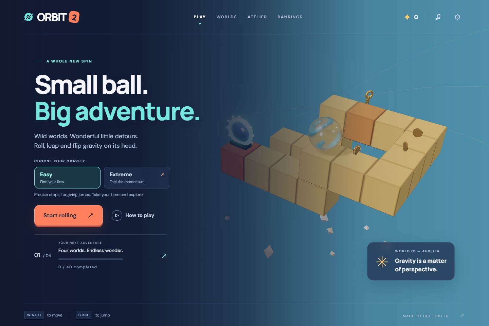
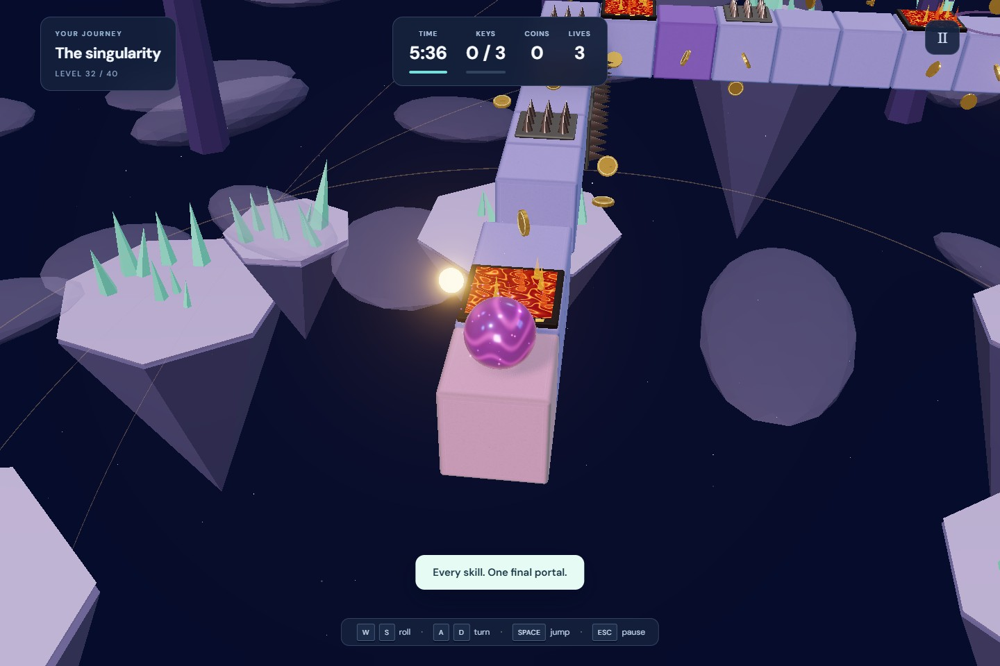
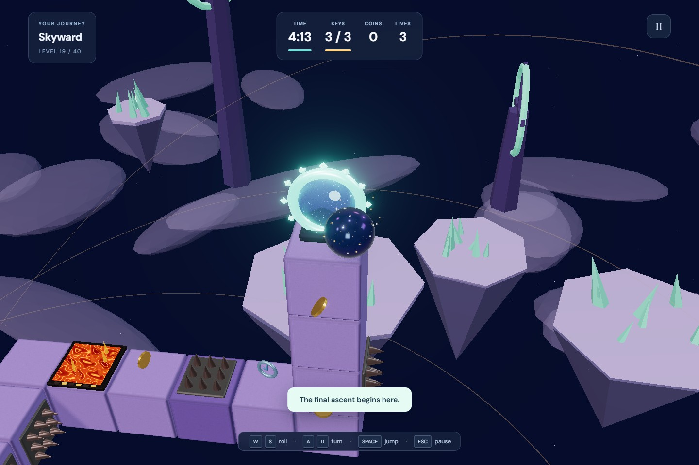
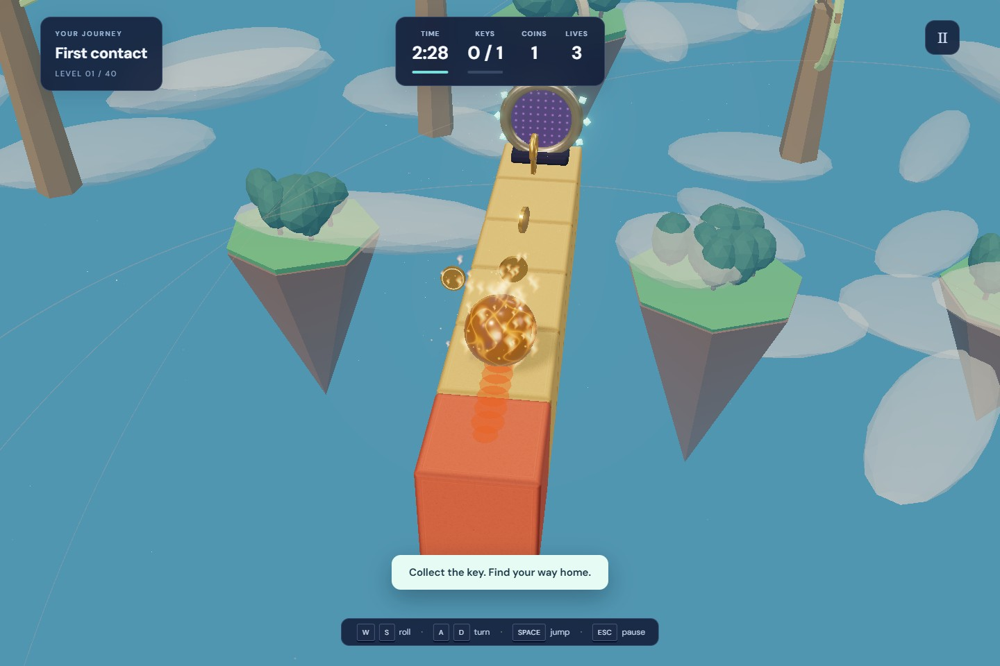
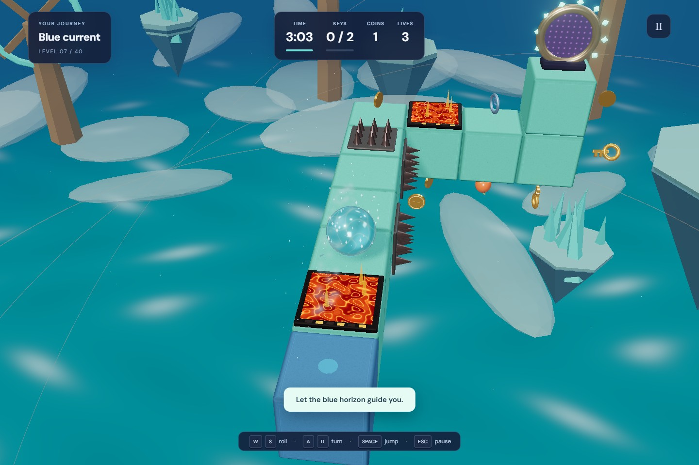
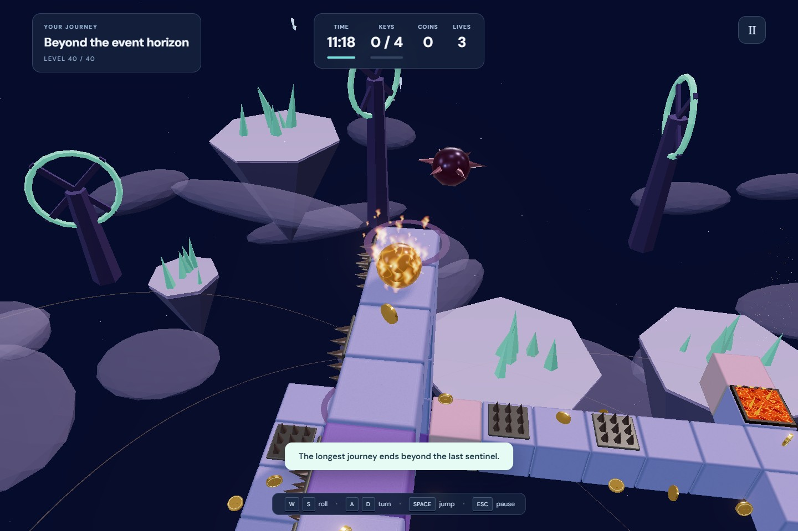
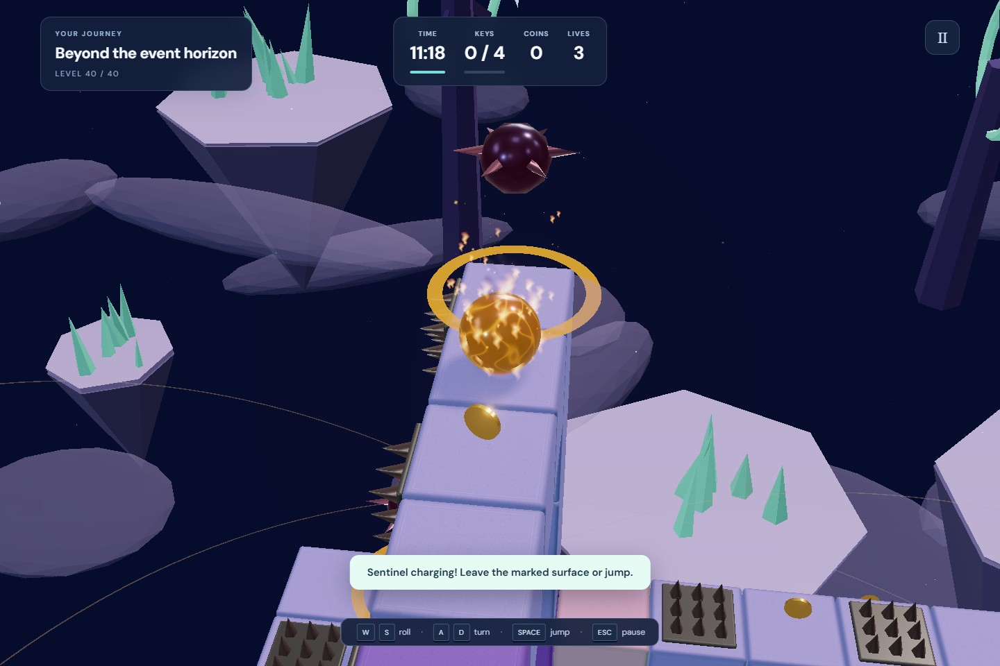

# ORBIT 2

**Small ball. Big adventure.** A colorful 3D gravity puzzle: roll across walls and ceilings, leap between islands, and unlock portals into other worlds.

### [Play ORBIT 2](https://jaydemks.github.io/orbit_game_2/) · [Play the original ORBIT](https://jaydemks.github.io/orbit_game/)

ORBIT 2 is a separate release with its own saves. The original game stays available unchanged.



| Neon challenges | A window into another world |
| --- | --- |
|  |  |

- **40 levels, four living worlds:** gardens, oceans, volcanic machinery and cosmic islands, with animated flying creatures and structures.
- **Easy or Extreme:** classic precise steps by default, or physical acceleration, inertia, braking and speed-dependent jumps. Slow down to wrap around edges; excessive speed can send you into the void.
- **Ten earnable spheres:** glass, pearl and crystal join fire, ice, plasma and stardust. Fire and ice leave fading surface trails.
- **Sentinels from level 17:** watch their warning zones, dodge or jump their pulse. Glass shatters; the Classic ball deflates. Eight new expeditions add larger circuits, elevated bridges and four-key routes.
- **Optional verified rankings:** play without an account, or voluntarily submit a replay through your GitHub identity. Transparent scoring combines level progress, exploration, normalized remaining time and surviving lives, with a 1.35× Extreme multiplier. The home menu features the real Top Explorer as soon as the first run is approved. [How rankings, scoring and owner moderation work](docs/rankings.md).
- Fire tongues, embers, soft smoke, ice fragments and mist use shared particle pools. Readable English menus, mobile controls, shader warm-up and adaptive resolution.
- Separate **Music** and **Sound effects** volume sliders; mute either without losing the other.

| Inferno | Frost |
| --- | --- |
|  |  |

| Control | Easy | Extreme |
| --- | --- | --- |
| W / S or ↑ / ↓ | Step forward / backward | Accelerate / reverse thrust to brake |
| A / D or ← / → | Turn 90° | Steer continuously; momentum persists |
| Space | Jump two blocks | Jump with your current velocity |
| Esc / R | Pause / restart | Pause / restart |

Touch buttons support steering and acceleration together. Difficulty changes apply to the next attempt; records are tracked separately.

| Larger expeditions | Sentinel warning |
| --- | --- |
|  |  |

## Soundtrack

Add `Track_01.mp3` through `Track_10.mp3` to [`public/music/`](public/music/) and push to `main`. Present tracks shuffle without consecutive repeats and crossfade over five seconds. Missing tracks use a procedural ambient fallback. Audio starts after interaction; independent volume sliders control music and effects. See the [soundtrack notes](public/music/README.md).

## Development

Node.js 22.12+ and WebGL 2 are required.

```sh
npm ci
npm run dev
npm test
npm run test:browser
npm run build
```

Browser tests require Chrome on Windows or `npx playwright install chromium` elsewhere. Tests solve all 40 levels in Easy with active enemies and no lost lives and cover Extreme inertia, jumps, collisions, 832 surface transitions and a complete input-driven first-level run. The full Extreme campaign has not been automated end to end.

Pushes to this repository's `main` deploy **only ORBIT 2** to GitHub Pages. The original repository is independent. Built with Three.js and Vite; procedural artwork and effects. An original homage to Kula World, not affiliated with its owners. MIT licensed.
