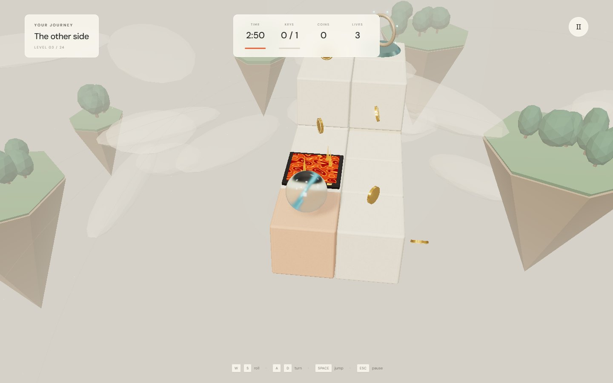
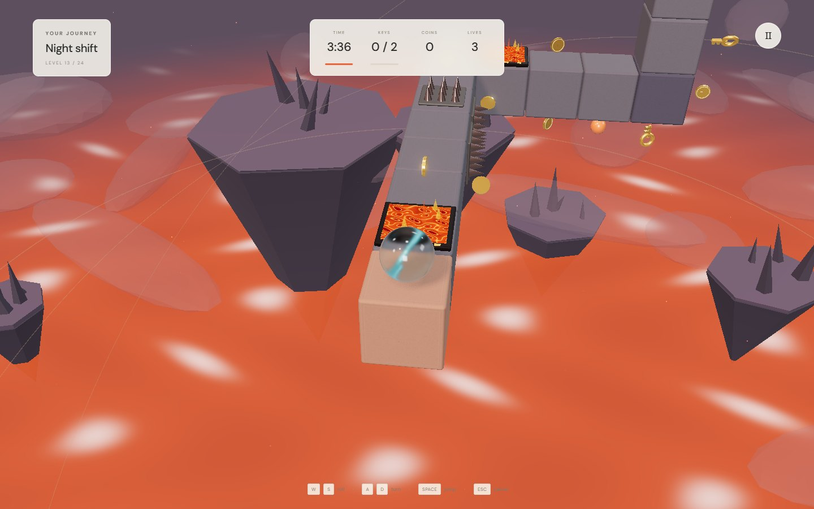

# ORBIT

**A gravity-defying 3D puzzle game. Roll around walls and ceilings, jump between floating islands, collect every key and reach the portal.**

### [▶ Play in your browser](https://jaydemks.github.io/orbit_game/)


| Sunlit islands | Volcanic hazards |
| --- | --- |
|  |  |

## What to expect

- **24 levels, four living worlds:** drifting clouds, floating gardens, animated oceans, volcanic embers and starry skies. Each level has its own seeded scenery.
- **Real challenges:** mandatory gap jumps from level 2, burning tiles from level 3, spikes and a countdown. Falls, burns and timeouts cost lives; lose all three and retry.
- **Six earnable skins:** refractive glass, iridescent crystal, pearl, obsidian and a classic beach ball. Coins are banked when you finish a level; progress saves in your browser.
- Smooth third-person camera, keyboard and touch controls. No downloads, accounts or paid purchases.
- Loading progress with shader warm-up, time/key/campaign bars, batched rendering and adaptive resolution. [Performance notes](docs/performance.md).

| Control | Action |
| --- | --- |
| W / S or ↑ / ↓ | Roll forward / backward |
| A / D or ← / → | Turn with the camera |
| Space | Jump two blocks forward |
| Esc / R | Pause / restart |

## Run locally

Node.js 22.12+ and WebGL 2 are required.

```sh
npm ci
npm run dev
```

`npm test` checks all 24 level solutions, hazards and saves. `npm run test:browser` checks gameplay, the camera and UI (requires Chrome on Windows or `npx playwright install chromium` elsewhere). `npm run build` creates the static site in `dist/`; pushes to `main` deploy through GitHub Actions.

Built with Three.js and Vite. All scenery and materials are generated locally. An original homage to Kula World, with original levels and artwork; not affiliated with its owners. MIT licensed.
